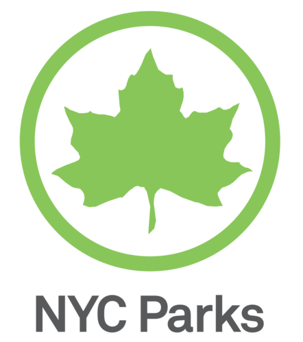

# Project 2: Shiny App Development

### [Project Description](doc/project2_desc.md)



# Project Title Park Time shiny app
Term: Spring 2022

+ Team 10
+ **Park Time Shiny app**: + Team members
	+ Patricia Song
	+ Krista Zhang
	+ Chang Lu


+ **Project summary**: 

In this project, we developed the Park Time app using R shiny, plus some common data analysis and EDA packages such as dplyr, tidyr and ggplot2.

There are three modules, each can help general users to quickly and efficiently know the NYC park data related to COVID-19 in different aspects.

+ **Contribution statement**: ([default](doc/a_note_on_contributions.md)) 

Patricia developed the Park Amenities page.
Krista developed the Map of Parks page.
Chang developed the Park Crimes page.
The rest work was contributed equally by all members.

Following [suggestions](http://nicercode.github.io/blog/2013-04-05-projects/) by [RICH FITZJOHN](http://nicercode.github.io/about/#Team) (@richfitz). This folder is orgarnized as follows.

```
proj/
├── app/
├── lib/
├── data/
├── doc/
└── output/
```

Please see each subfolder for a README file.

